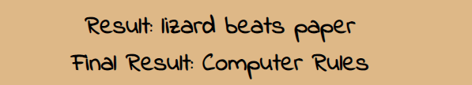
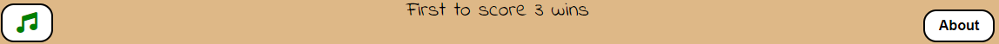

## Table of Contents
* [Purpose](#purpose)
 * [User Experience Design (UX)](#user-experience-design)
  * [User stories](#user-stories)
    * [First Time Visitor Goals](#first-time-visitor-goals)
    * [Returning Visitor Goals](#returning-visitor-goals)
    * [Frequent Visitor Goals](#frequent-visitor-goals)
  * [Structure](#structure)  
  * [Design](#design)
    * [Colour Scheme](#color-scheme)
    * [Typography](#typography)    
    * [Wireframes](#Wireframes)
* [Features](#features)    
* [Technologies](#technologies)
* [Testing](#testing)
  * [Bugs](#bugs)
* [Deployment](#deployment)
* [Credits](#credits) 
    * [Media](#media)
    * [Content](content)
    * [Code and Tutorials](#code-and-tutorials)
    

# ROCK SCISSORS PAPER LIZARD SPOCK GAME
## Purpose:
### Goal:
#### To produce a game of chance that will provide the user with the opportunity to show their competitive instincts whilst not actually having to compete againest another individual.
#### To provide a visual and interactive experience that the user will ant to return to.
This is primarily a game of chance but also skill for after time you may be able to predict your opponent.
The basic rock, scissors, paper game  can be  traced back to the Ming Dynasty (1368-1644) It has been used in court cases to resolve disputes (USA 2006 - Avista Management v. Wausau), in sports matches (UK Womens Super League where there was no coin it was used to decide who would kick off).
There are also the World Societies and Associations and numerous global championships. 

The live website can be found [here](https://andyk8872.github.io/project-2/).

## Rock Scissors Paper Lizard Spock Website

*** 
## User Experience Design

### User stories
#### First Time Visitor Goals
* As a First Time user, I want to easily understand the main purpose of the site.
* As a first time user, I want to be able to play the game and participate in the experience.
* As a First Time user, I want to view the website and content clearly on my mobile device.
* As a Firt Time user, I want to find to be able to contact the site owners.
#### Returning Visitor Goals
* As a Returning user, I want to enjoy the experience and the interactive options .
* As a Returning user, I want to contact the site owners so I can share my experience.
#### Frequent Visitor Goals
* As a Frequent user, I want to check to see if there are any changes.
* As a Frequent user, I want to check to see if there are any new updates.
***

## Structure
The main page is the Game page.
The purpose of this is to fulfill the user story:
> As a First Time user, I want to easily understand the main purpose of the site.

Custom CSS will be used to make the website responsive by the use of media queries.

The site will be responsive and the layout will change dependent on the screen size. This is to enhance the user experience.

> As a Firt Time user, I want to find to be able to contact the site owners.

In the contact page there will be be an area to leave a message for the site owners.
***

## Design
### Color Scheme:
The colors were chosen to complement each other as well as provide accessiblity. 
 

### Typography:
The Indie Flower and the Inknut Antiqua font are used throughout..
***

## Features
### Header:
#### A header with the game title.
   
## Game Images: 
#### The game images/icons (User choice and computer choice)
  
## Results: 
#### The result of each turn and the final result.(Final result not shown on smaller screen sizes)
  
## Player buttons: 
#### The buttons for the player to choose from.
  
## Score Board:
### Player and Computer Score. 
  
## Instructions:
### Player instructions. 
  
## Sound and About(instruction) buttons: 
  

## The About Modal (Which icon beats which): 
  
## The Win Modal (Shows the player is victorious and countdowns until restart):
  
## The Lose Modal (Shows the player has lost and countdowns until restart: 
  

***
## Deployment:
### Using Github Pages
  1. Navigate to the GitHub [Repository:](https://github.com/andyk8872/project-2)
  1. Click the 'Settings' Tab.
  1. Goto the Git Hub Pages Heading.
  1. Select 'Main Branch' as the source.
  1. Click the Save button.
  1. Click on the link to go to the live deployed page. [Live Site:](https://andyk8872.github.io/project-2)  

### Run Locally
  1. Navigate to the GitHub [Repository:](https://andyk8872.github.io/project-2/)
  1. Click the Code drop down menu.
  1. Either Download the ZIP file, unpackage locally and open with IDE (This route ends here) OR Copy Git URL from the HTTPS dialogue box.
  1. Open your developement editor of choice and open a terminal window in a directory of your choice.
  1. Use the 'git clone' command in terminal followed by the copied git URL.
  1. A clone of the project will be created locally on your machine.
  
  ***

## Technologies:
*  HTML
	* This project uses HTML as the markup language to structure the Website.
* CSS
	* This project uses custom written CSS to style the Website.
* Javascript
  * This project uses Javascript to implement dynamic features on the site and therefore making it  interactive.
* [Google Fonts](https://fonts.google.com/)
  * This project uses Google Fonts (Indie Flower and Inknut)
* [GitHub](https://github.com/)
  * GitHub is the hosting site used to store the source code for the Website and is used for the deployment of the live site.
* [iPiccy](http://ipiccy.com) and [Pixelied](https://pixelied.com)
  * These sites were useed to edit the sites Game images.
* [Freepiq](http://freepiq.com)
  * The background image was sourced from Freepiq.com
* [Color.io](http://color.io)
  * The color pallete was derived from color.io.
* [Sound](https://www.audiomicro.com/free-sound-effects)
  * The sounds were sourced from audiomicro.com.
* [Font Awesome](https://fontawesome.com/)  
  * The icon in the contact section.
  * The icons for the sound on/off button.
* [Coolors](https://coolors.co/)
  * The program for the Color Palete.           
  ***

## Testing:
* ### Code Validation
  * The Game has been throughly tested. All the code has been validated through w3c HTML Validator, w3c CSS Validator and the JSHint Validator.
    Any errors shown were remedied. This can all be seen below.  

* ### HTML Validation Image
  * The first image shows the errors and the second shows the image after errors remedied.

    
      

* ### CSS Validation Image:    
  * The first image shows the errors and the second shows the image after errors remedied.

    
      

* ### JSHint Code Quality Tool:
  * The image shows the results from the JSHint tool.

       

* ### Lighthouse Testing Results:
  * The results from the Lighthouse Testing tool (Desktop).

     
  * The results from the Lighthouse Testing tool (Mobile).
  
     

    ***     
* ## Bugs:
  * Using Font Awesome icons the HTML buttons (user choice) resulted in the  javascript script not acknowleding the user clicks.
    The only solution I found was to remove Font Awesome icons fron the buttons.
  * For some reason the Font Awesome 'volume' icon would not work in the project. (I have as yet no solution other than to use an alternative icon)   
  * When I commented out the 'Final Result' div in order to reduce the size of the game area, various function of the game would not work.
   This was because the 'div' was insturumental in those other functions. The  solution was to use media-query to hide the 'div' as the screen reduced size.

   ***
## Credits:
* ###  Code and Tutorials    
  * [Love Maths](https://learn.codeinstitute.net/)
    * The score function was reproduced from the Code Institute Love Maths project. 
  * [Free Frontend](https://freefrontend/)
     * The contact form structure was taken from a Freefrontend.com templete.
     ***   
## Acknowledgements:
 * I would like to thank my mentor Ronan McClelland for his guidence throughout this project.
 * As this was my first javascript project and, I would like to thank all in the Slack community who helped me in such areas as
   JSHint when I had many errors and ppointed me in the rigght direction.
      

